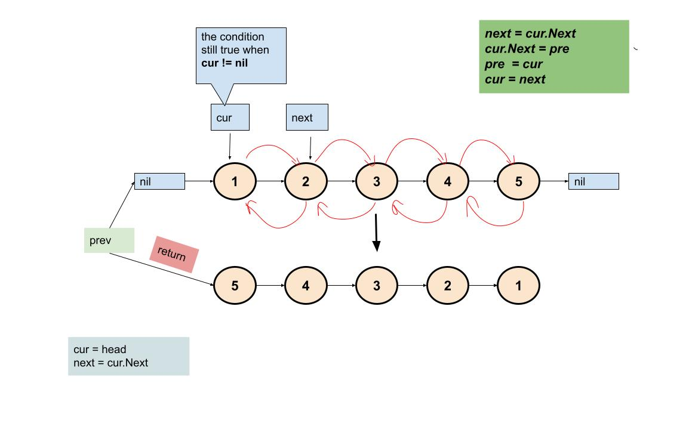
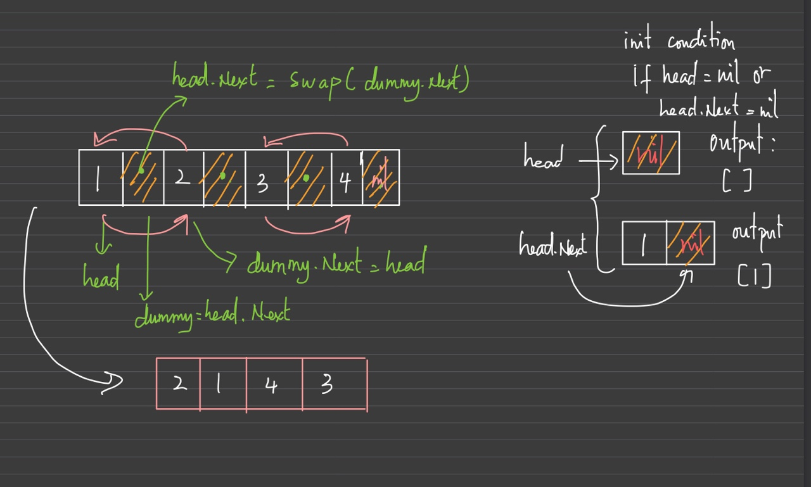

1. [ ✅206. 反转链表](#-206-反转链表)
1. [ ✅24. 两两交换链表中的节点](#-24-两两交换链表中的节点)

-----

- [X] 206 反转链表

```go
/**
 * Definition for singly-linked list.
 * type ListNode struct {
 *     Val int
 *     Next *ListNode
 * }
 */

func reverseList(head *ListNode) *ListNode {
    var pre *ListNode
    cur := head
    for cur != nil {
        next := cur.Next
        cur.Next = pre
        pre = cur
        cur = next
    }
    return pre
}
```
复杂度分析

- 时间复杂度：O(n)，其中 n 是链表的长度。需要遍历链表一次。

- 空间复杂度：O(1)。




- [X] 24 两两交换链表中的节点

```go
/**
 * Definition for singly-linked list.
 * type ListNode struct {
 *     Val int
 *     Next *ListNode
 * }
 */
func swapPairs(head *ListNode) *ListNode {
    
    if head == nil || head.Next == nil {
        return head
    }

    dummy := head.Next
    head.Next = swapPairs(dummy.Next)
    dummy.Next = head

    return dummy
}
```

复杂度分析

- 时间复杂度：O(n)，其中 n 是链表的长度。需要遍历链表一次。

- 空间复杂度：O(1)。

